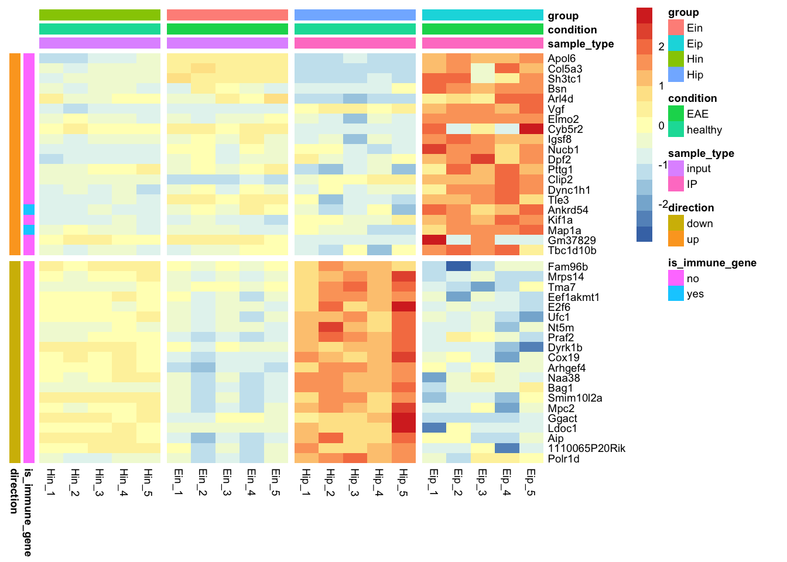

<!-- README.md is generated from README.Rmd. Please edit that file -->

# tidyheatmaps

<!-- badges: start -->

[](https://codecov.io/gh/jbengler/tidyheatmaps?branch=master)
[](https://www.tidyverse.org/lifecycle/#experimental)
<!-- badges: end -->

The goal of `tidyheatmaps` is to provide a tidyverse-style interface to
the powerful heatmap package
[pheatmap](https://github.com/raivokolde/pheatmap) by
[@raivokolde](https://github.com/raivokolde). This enables the
convenient generation of complex heatmaps from tidy data with minimal
code.

## Installation

You can install `tidyheatmaps` from GitHub with:

``` r
# install.packages("devtools")
devtools::install_github("jbengler/tidyheatmaps")
```

## Example

Given a tidy data frame of gene expression data like `data_exprs`, you
can easily generate a customized heatmap.

``` r
library(tidyheatmaps)

tidy_heatmap(data_exprs,
             rows = external_gene_name,
             columns = sample,
             values = expression,
             scale = "row",
             annotation_col = c(sample_type, condition, group),
             annotation_row = c(is_immune_gene, direction),
             gaps_row = direction,
             gaps_col = group
)
```



## Learn more

<https://jbengler.github.io/tidyheatmaps/>
