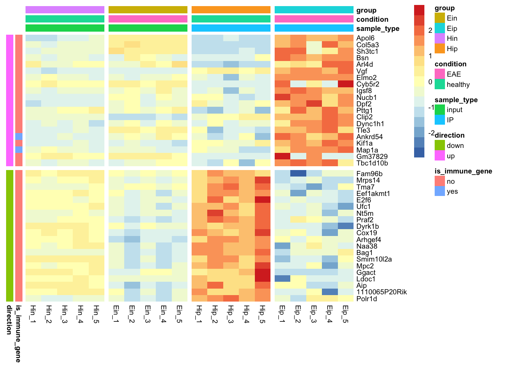

<!-- README.md is generated from README.Rmd. Please edit that file -->

# tidyheatmaps 

<!-- badges: start -->

[](https://github.com/jbengler/tidyheatmaps/actions/workflows/R-CMD-check.yaml)
<!-- badges: end -->

The goal of tidyheatmaps is to simplify the generation of
publication-ready heatmaps from tidy data. By offering an interface to
the powerful pheatmap package, it allows for the effortless creation of
intricate heatmaps with minimal code. By offering an interface to the
powerful [pheatmap](https://github.com/raivokolde/pheatmap) package, it
allows for the effortless creation of intricate heatmaps with minimal
code.

## Installation

You can install the released version of tidyheatmaps from
[CRAN](https://cran.r-project.org/) with:

``` r
install.packages("tidyheatmaps")
```

And the development version from [GitHub](https://github.com/) with:

``` r
# install.packages("devtools")
devtools::install_github("jbengler/tidyheatmaps")
```

## Usage

Given a tidy data frame of gene expression data like `data_exprs`, you
can easily generate a customized heatmap. The full documentation can be
found [here](https://jbengler.github.io/tidyheatmaps/).

``` r
library(tidyheatmaps)

tidyheatmap(data_exprs,
            rows = external_gene_name,
            columns = sample,
            values = expression,
            scale = "row",
            annotation_col = c(sample_type, condition, group),
            annotation_row = c(is_immune_gene, direction),
            gaps_row = direction,
            gaps_col = group
)
```



## Acknowledgements

tidyplots relies on a number of fantastic packages that do all the heavy
lifting behind the scenes. These include dplyr, pheatmap, rlang,
grDevices, tidyr, tibble and RColorBrewer.
